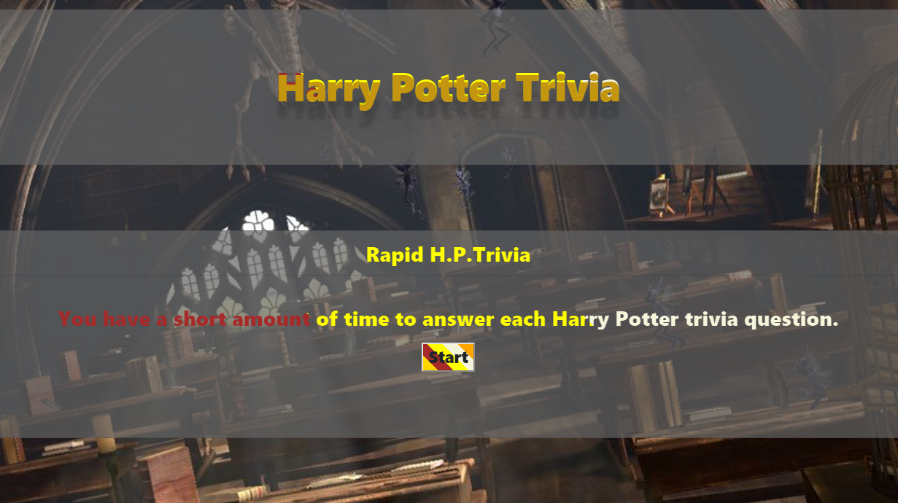
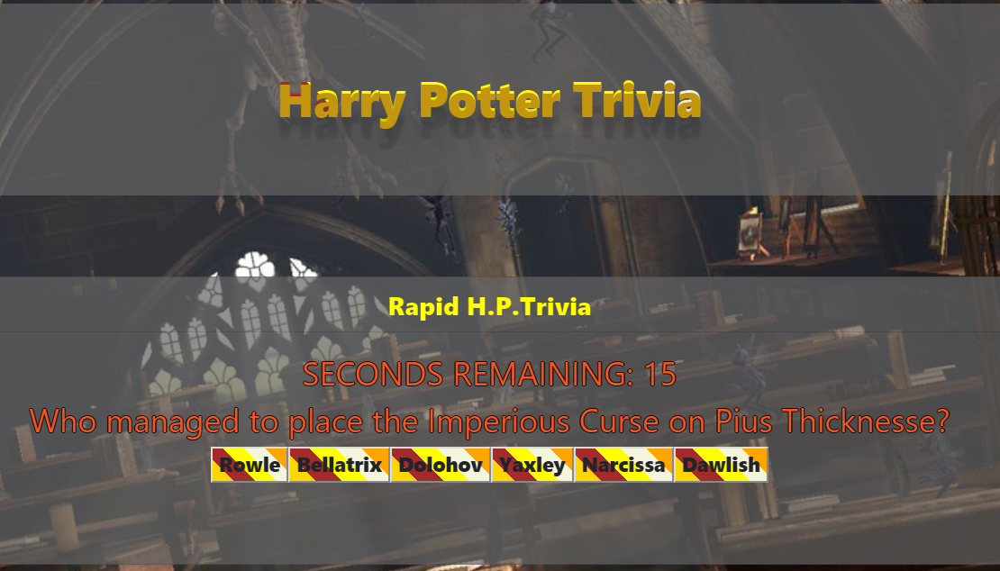
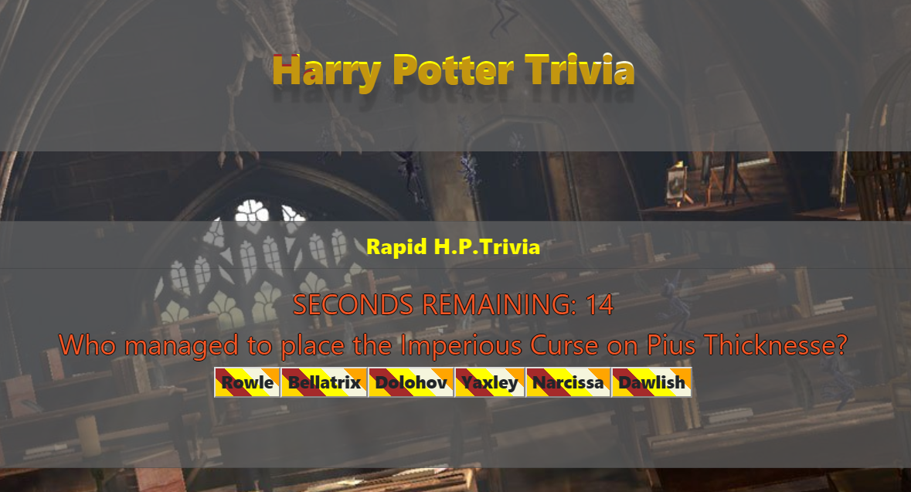
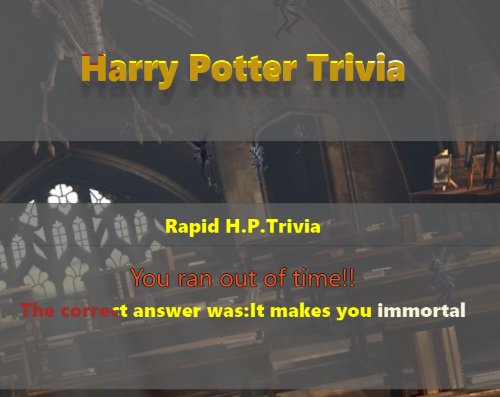

###### Trivia Game
# [Trivia Game](https://angel2367716.github.io/TriviaGame/)

### Summary:
A simple Web Application that allows the User to play a simple trivia game. 

### Technologies used:
* JQuery
* Javascript
* CSS
* HTML

### User Guide:

#### Home Page

#### Timer

#### Out of time

#### Results

